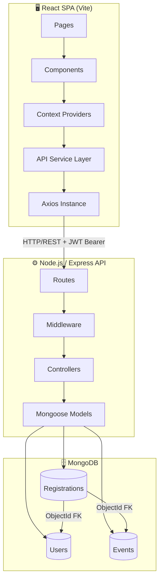
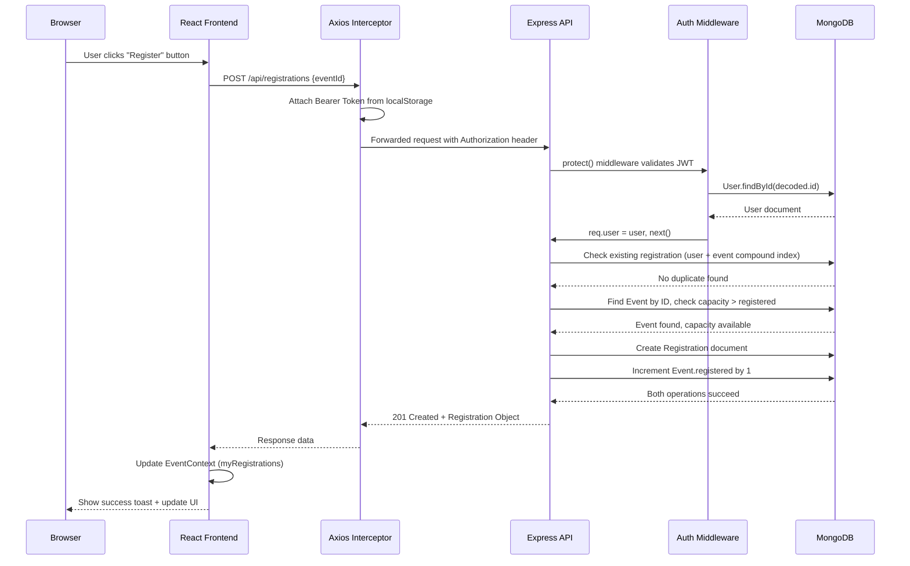
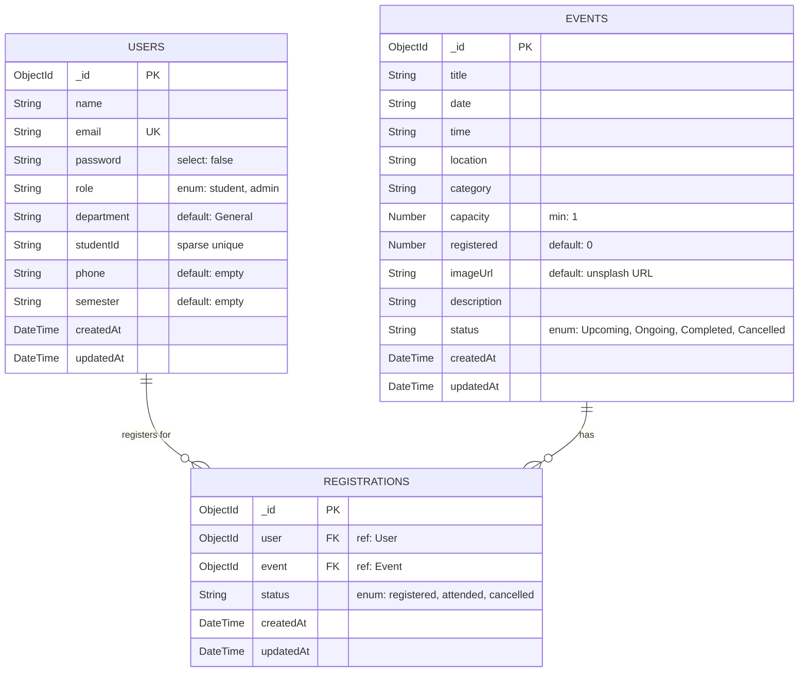

<p align="center">
  
</p>

<h1 align="center">EventFlow</h1>
<h3 align="center">The Unified University Event Management Ecosystem</h3>

<p align="center">
  
  
  
  
  
  
  
  
</p>

<p align="center">
  <i>A professional, highly-polished full-stack web application designed to centralize campus discovery, student engagement, and event analytics. Built from the ground up to solve the fractured nature of university communications, EventFlow provides a single source of truth for all Academic, Sports, Cultural, and Technical events.</i>
</p>

---

## 📑 Table of Contents

1.  [📖 About The Project](#-about-the-project)
2.  [🎯 Problem Statement & Solution](#-problem-statement--solution)
3.  [✨ Feature Inventory](#-feature-inventory)
    - [Public Features](#public-features)
    - [Student Features](#student-features-authenticated)
    - [Admin Features](#admin-features-authenticated)
4.  [🛠️ Technology Stack Deep Dive](#️-technology-stack-deep-dive)
5.  [🏗️ System Architecture](#️-system-architecture)
    - [High-Level Architecture Diagram](#high-level-architecture-diagram)
    - [Data Flow: Event Registration Sequence](#data-flow-event-registration-sequence)
    - [Core Architecture Decisions](#core-architecture-decisions)
6.  [🗄️ Database Schema & Relationships](#️-database-schema--relationships)
    - [Entity-Relationship Diagram](#entity-relationship-diagram)
    - [Users Collection](#1-users-collection)
    - [Events Collection](#2-events-collection)
    - [Registrations Collection](#3-registrations-collection-junction-table)
7.  [📡 Comprehensive API Reference](#-comprehensive-api-reference)
    - [Authentication Endpoints](#authentication-apiauth)
    - [Event Endpoints](#events-apievents)
    - [Registration Endpoints](#registrations-apiregistrations)
    - [Admin Endpoints](#admin-apiadmin)
8.  [🔐 Security Architecture](#-security-architecture)
9.  [🎨 Frontend Design System](#-frontend-design-system)
    - [Design Tokens](#design-tokens)
    - [Component Library](#component-library)
    - [Animation Philosophy](#animation-philosophy)
10. [📂 Complete Project Structure](#-complete-project-structure)
11. [🚀 Getting Started](#-getting-started)
    - [Prerequisites](#prerequisites)
    - [Environment Variables](#environment-variables)
    - [Installation Steps](#installation-steps)
    - [Database Seeding](#database-seeding)
12. [🧪 Testing & Demo Credentials](#-testing--demo-credentials)
13. [📄 Application Routes & Screens](#-application-routes--screens)
14. [👥 Team Roles & Responsibilities](#-team-roles--responsibilities)
15. [🔮 Future Roadmap (V2.0)](#-future-roadmap-v20)
16. [👨‍💻 Author & License](#-author--license)

---

## 📖 About The Project

EventFlow is a **full-stack, production-grade web application** engineered for Aditya University that unifies all campus events — from multi-day cultural festivals and inter-college hackathons to intimate guest lectures and sports meets — into a single, beautifully designed digital hub.

Built on the **MERN stack** (MongoDB, Express.js, React 19, Node.js) with a cutting-edge frontend powered by Vite 7, Framer Motion, GSAP, and Three.js, EventFlow delivers an experience that feels more like a premium SaaS product than a university tool.

The platform serves **two distinct user personas**:
- **Students** — discover, explore, register for, and track university events through a personalized dashboard.
- **Administrators** — create, manage, and monitor events with real-time analytics, student directories, and engagement reports.

---

## 🎯 Problem Statement & Solution

### The Problem
University campuses universally suffer from **"information fragmentation"**. Event details are scattered across:
- Departmental WhatsApp groups
- Physical notice boards
- Sporadic email blasts
- Independent club websites
- Word of mouth

This fragmentation leads to **low event attendance**, **missed opportunities for students**, and **zero actionable data** for organizers.

### The Solution
EventFlow eliminates fragmentation by providing:

| Pain Point | EventFlow Solution |
|---|---|
| Events scattered across platforms | Centralized discovery engine with category filters |
| No way to track registrations | Personalized "My Events" dashboard with status tracking |
| Manual headcounts | Atomic, real-time capacity management with overbooking prevention |
| No engagement metrics | Admin analytics dashboard with category breakdown and registration trends |
| Inconsistent branding | Unified, premium dark-themed UI with glassmorphism aesthetics |
| Domain security concerns | Role-based email domain enforcement at registration |

---

## ✨ Feature Inventory

### Public Features
| Feature | Description |
|---|---|
| **Landing Page** | Immersive hero section with Three.js `LightPillar` particle effects, animated `EtheralShadow` global background, and smooth GSAP scroll animations |
| **Event Catalog** | Browse all university events with client-side pagination (9 per page), category filtering (Academic, Sports, Cultural, Technical), and debounced keyword search |
| **Event Detail Pages** | Deep-linked event pages (`/events/:id`) showing full metadata: date, time, venue, capacity utilization bar, banner image, and description |
| **Photo Gallery** | Visual gallery page (`/gallery`) showcasing past event highlights |
| **Animated Logo** | Custom `AnimatedEventFlowLogo` component with animated conic-gradient glow effects on the brand mark |

### Student Features (Authenticated)
| Feature | Description |
|---|---|
| **Secure Registration** | Domain-enforced signup requiring `@adityauniversity.in` email addresses |
| **Personalized Dashboard** | Multi-tab dashboard with Overview, My Events, and Settings sections |
| **One-Click Event Registration** | Atomic registration that prevents overbooking via server-side capacity checks |
| **"My Events" Tracker** | Visual grid of all registered events with quick navigation to event details |
| **Stat Cards** | Real-time display of registered count, attended events, certificates earned, and engagement points |
| **Event Recommendations** | "Recommended Events" section showing upcoming events the student hasn't registered for, with inline quick-register buttons |
| **Profile Management** | Update name, phone, department, and semester from the Settings tab |
| **Password Change** | Secure password update requiring current password verification |
| **E-Ticket Modal** | View a digital ticket with QR placeholder for any registered event |
| **Certificate Downloads** | Download completion certificates for attended events |
| **Notification System** | `NotificationDropdown` component for real-time alerts |

### Admin Features (Authenticated)
| Feature | Description |
|---|---|
| **Secure Admin Login** | Domain-enforced signup requiring `@aditya.edu` email addresses |
| **Admin Dashboard** | Multi-tab command center with Overview, Manage Events, Students, Reports, and Settings tabs |
| **Event CRUD** | Full lifecycle management: Create, Read, Update, and Delete events with rich metadata (title, date, time, venue, category, capacity, image URL, description, status) |
| **Inline Event Editing** | Edit events directly within the dashboard via an integrated modal form |
| **Student Directory** | Searchable directory of all registered students with name, email, and department |
| **Analytics Reports** | Overview metrics (total students, active events, total registrations, engagement growth) plus attendance breakdown by event category |
| **Recent Activity Feed** | 5 most recent registrations with student name, event title, category, and timestamp |
| **Quick-Action Events** | Manage Events tab with search, filter by category, and bulk action capabilities |

---

## 🛠️ Technology Stack Deep Dive

### Frontend

| Technology | Version | Purpose |
|---|---|---|
| **React** | 19.2 | UI component library with hooks and functional components |
| **Vite** | 7.2 | Next-generation frontend tooling: HMR, ESBuild, optimized production bundles |
| **React Router DOM** | 7.13 | Declarative client-side routing with nested layouts |
| **Framer Motion** | 12.34 | Declarative layout animations, page transitions, and `AnimatePresence` exit animations |
| **GSAP** | 3.14 | High-performance scroll-triggered animations on the landing page |
| **Three.js** | 0.182 | WebGL-powered 3D particle effects (`LightPillar` component) on the hero section |
| **Axios** | 1.13 | Promise-based HTTP client with request/response interceptors |
| **Lucide React** | 0.563 | Modern, tree-shakeable SVG icon library (500+ icons) |
| **Tailwind CSS** | 3.4 | Utility-first CSS framework (used selectively for glowing UI components) |
| **clsx** | 2.1 | Conditional className utility for clean JSX |

### Backend

| Technology | Version | Purpose |
|---|---|---|
| **Node.js** | 20.x | Server-side JavaScript runtime |
| **Express** | 5.2 | Minimal, unopinionated web framework for RESTful APIs |
| **Mongoose** | 9.2 | MongoDB ODM with schema validation, middleware hooks, and query builders |
| **bcryptjs** | 3.0 | Password hashing with configurable salt rounds (10 rounds) |
| **jsonwebtoken** | 9.0 | Stateless JWT-based authentication (30-day expiry) |
| **cors** | 2.8 | Cross-Origin Resource Sharing middleware |
| **dotenv** | 17.3 | Environment variable management from `.env` files |

### Database

| Technology | Purpose |
|---|---|
| **MongoDB** | NoSQL document database — schema flexibility for events of varying types |
| **MongoDB Atlas** | Cloud-hosted database option for production deployments |

### DevOps & Tooling

| Tool | Purpose |
|---|---|
| **ESLint 9** | JavaScript/JSX linting with React hooks and refresh plugins |
| **PostCSS** | CSS transformation pipeline with Autoprefixer |
| **Git** | Version control with `.gitignore` configured for `node_modules`, `.env`, and build artifacts |

---

## 🏗️ System Architecture

### High-Level Architecture Diagram



### Data Flow: Event Registration Sequence



### Core Architecture Decisions

| Decision | Rationale |
|---|---|
| **React Context over Redux** | Lightweight state management for two global stores (`AuthContext`, `EventContext`) — avoids Redux boilerplate overhead for a medium-complexity application |
| **Axios Interceptors** | Global request interceptor auto-attaches JWT token; response interceptor catches `401 Unauthorized` errors, clears local storage, and redirects to `/auth` — eliminates manual error handling across all components |
| **Client-side Pagination** | Events are fetched in a single API call and paginated on the frontend via `Array.slice()` — a pragmatic choice that avoids backend pagination complexity while the event catalog remains under ~500 items |
| **CSS Custom Properties over Tailwind (primary)** | The design system uses CSS variables (`variables.css`) for theming, shadows, spacing, and transitions — Tailwind is used selectively for utility classes in animated UI components |
| **CommonJS Backend / ESM Frontend** | Backend uses `require()` (CommonJS) for maximum Node.js compatibility; Frontend uses `import` (ESM) as required by Vite |
| **Domain-Based Role Enforcement** | Email domain validation at registration prevents unauthorized access — `@adityauniversity.in` for students, `@aditya.edu` for admins |

---

## 🗄️ Database Schema & Relationships

EventFlow uses MongoDB with Mongoose 9 for Object Data Modeling (ODM). The database consists of three core collections connected through a **Many-to-Many** relationship via a junction table.

### Entity-Relationship Diagram



### 1. Users Collection

**File:** `Backend/models/User.js`

| Field | Type | Constraints | Description |
|---|---|---|---|
| `name` | String | **required** | Full name of the user |
| `email` | String | **required**, **unique**, regex validated | Institutional email address |
| `password` | String | **required**, minlength: 5, `select: false` | Bcrypt-hashed password (never returned in queries by default) |
| `role` | String | enum: `['student', 'admin']`, default: `'student'` | Determines UI experience and API access level |
| `department` | String | default: `'General'` | Academic department |
| `studentId` | String | **sparse unique** | University roll number (e.g., `24B11CS001`) |
| `phone` | String | default: `''` | Contact number |
| `semester` | String | default: `''` | Current semester |

**Middleware:**
- **Pre-save hook**: Automatically hashes the password using `bcryptjs` with 10 salt rounds before insertion. Only triggers if the `password` field has been modified.
- **Instance method** `matchPassword(enteredPassword)`: Compares a plaintext password against the stored hash using `bcrypt.compare()`.

### 2. Events Collection

**File:** `Backend/models/Event.js`

| Field | Type | Constraints | Description |
|---|---|---|---|
| `title` | String | **required** | Event display name |
| `date` | String | **required** | Event date (stored as string for frontend alignment) |
| `time` | String | **required** | Event time (e.g., `"09:00 AM"`) |
| `location` | String | **required** | Physical venue |
| `category` | String | **required** | Event type for filtering (Academic, Cultural, Sports, Technical) |
| `capacity` | Number | **required**, min: 1 | Maximum number of attendees |
| `registered` | Number | default: 0 | Current number of registered attendees |
| `imageUrl` | String | default: Unsplash fallback | Banner image URL |
| `description` | String | optional | Detailed event description |
| `status` | String | enum: `['Upcoming', 'Ongoing', 'Completed', 'Cancelled']`, default: `'Upcoming'` | Lifecycle status |

### 3. Registrations Collection (Junction Table)

**File:** `Backend/models/Registration.js`

| Field | Type | Constraints | Description |
|---|---|---|---|
| `user` | ObjectId | **required**, ref: `'User'` | Foreign key to the Users collection |
| `event` | ObjectId | **required**, ref: `'Event'` | Foreign key to the Events collection |
| `status` | String | enum: `['registered', 'attended', 'cancelled']`, default: `'registered'` | Registration lifecycle state |

**Critical Index:**
```javascript
registrationSchema.index({ user: 1, event: 1 }, { unique: true });
```
This **compound unique index** guarantees idempotency — a single student can never register for the same event twice. Duplicate registration attempts will throw a MongoDB `E11000` duplicate key error, which is caught and returned as a user-friendly error message.

---

## 📡 Comprehensive API Reference

The backend exposes a RESTful API organized into four route groups. All protected endpoints require an `Authorization: Bearer <token>` header.

**Base URL:** `http://localhost:5000/api`

### Authentication (`/api/auth`)

| Method | Endpoint | Protection | Description |
|--------|----------|------------|-------------|
| `POST` | `/register` | Public | Register a new user account |
| `POST` | `/login` | Public | Authenticate and receive a JWT |
| `GET` | `/me` | Protected | Retrieve current user profile |
| `PUT` | `/profile` | Protected | Update user profile fields |
| `PUT` | `/password` | Protected | Change user password |

<details>
<summary><strong>POST /api/auth/register</strong> — Register New User</summary>

**Request Body:**
```json
{
  "name": "Student 24B11CS001",
  "email": "24B11CS001@adityauniversity.in",
  "password": "12345",
  "role": "student",
  "department": "Computer Science",
  "studentId": "24B11CS001"
}
```

**Validation Rules:**
- `name`, `email`, `password` are required
- If `role === 'student'`: email **must** end with `@adityauniversity.in`
- If `role === 'admin'`: email **must** end with `@aditya.edu`
- Email must match regex: `/^\w+([\.-]?\w+)*@\w+([\.-]?\w+)*(\.\w{2,3})+$/`
- Password minimum length: 5 characters

**Success Response (201):**
```json
{
  "_id": "665a1b2c3d4e5f678901abcd",
  "name": "Student 24B11CS001",
  "email": "24B11CS001@adityauniversity.in",
  "role": "student",
  "token": "eyJhbGciOiJIUzI1NiIsInR5cCI6IkpXVCJ9..."
}
```

**Error Responses:**
- `400` — Missing fields, user already exists, or invalid email domain
- `500` — Server error
</details>

<details>
<summary><strong>POST /api/auth/login</strong> — Authenticate User</summary>

**Request Body:**
```json
{
  "email": "24B11CS001@adityauniversity.in",
  "password": "12345"
}
```

**Success Response (200):**
```json
{
  "_id": "665a1b2c3d4e5f678901abcd",
  "name": "Student 24B11CS001",
  "email": "24B11CS001@adityauniversity.in",
  "role": "student",
  "token": "eyJhbGciOiJIUzI1NiIsInR5cCI6IkpXVCJ9..."
}
```

**Error Responses:**
- `401` — Invalid credentials or email domain mismatch for existing user
</details>

<details>
<summary><strong>GET /api/auth/me</strong> — Get Current User</summary>

**Headers:** `Authorization: Bearer <token>`

**Success Response (200):**
```json
{
  "_id": "665a1b2c3d4e5f678901abcd",
  "name": "Student 24B11CS001",
  "email": "24B11CS001@adityauniversity.in",
  "role": "student",
  "department": "Computer Science",
  "studentId": "24B11CS001",
  "phone": "",
  "semester": ""
}
```
</details>

<details>
<summary><strong>PUT /api/auth/profile</strong> — Update Profile</summary>

**Headers:** `Authorization: Bearer <token>`

**Request Body (all fields optional):**
```json
{
  "name": "Updated Name",
  "phone": "9876543210",
  "department": "Electronics",
  "semester": "4th"
}
```

**Success Response (200):** Returns the updated user object.
</details>

<details>
<summary><strong>PUT /api/auth/password</strong> — Change Password</summary>

**Headers:** `Authorization: Bearer <token>`

**Request Body:**
```json
{
  "currentPassword": "12345",
  "newPassword": "67890"
}
```

**Validation:**
- Both `currentPassword` and `newPassword` are required
- `newPassword` must be at least 5 characters
- `currentPassword` must match the stored hash

**Success Response (200):**
```json
{
  "message": "Password updated successfully"
}
```

**Error Responses:**
- `400` — Missing fields or new password too short
- `401` — Current password is incorrect
</details>

---

### Events (`/api/events`)

| Method | Endpoint | Protection | Description |
|--------|----------|------------|-------------|
| `GET` | `/` | Public | Fetch all events |
| `GET` | `/:id` | Public | Fetch single event by ID |
| `POST` | `/` | Admin Only | Create a new event |
| `PUT` | `/:id` | Admin Only | Update an existing event |
| `DELETE` | `/:id` | Admin Only | Delete an event |

<details>
<summary><strong>POST /api/events</strong> — Create Event (Admin)</summary>

**Headers:** `Authorization: Bearer <admin_token>`

**Request Body:**
```json
{
  "title": "AI & Machine Learning Workshop",
  "date": "2024-03-25",
  "time": "10:00 AM",
  "location": "Computer Lab 3",
  "category": "Technical",
  "capacity": 60,
  "description": "A hands-on workshop covering neural networks and deep learning.",
  "imageUrl": "https://images.unsplash.com/photo-1485827404703-89b55fcc595e",
  "status": "Upcoming"
}
```
</details>

---

### Registrations (`/api/registrations`)

| Method | Endpoint | Protection | Description |
|--------|----------|------------|-------------|
| `GET` | `/` | Protected | Fetch current user's registration history |
| `POST` | `/` | Protected | Register for an event (atomic capacity check) |
| `DELETE` | `/:id` | Protected | Cancel a registration |

<details>
<summary><strong>POST /api/registrations</strong> — Register for Event</summary>

**Headers:** `Authorization: Bearer <token>`

**Request Body:**
```json
{
  "eventId": "665a1b2c3d4e5f678901abcd"
}
```

**Server-side Validations (in order):**
1. Check if event exists → `404` if not
2. Check if user is already registered (compound index) → `400` if duplicate
3. Check if `event.registered < event.capacity` → `400` if full
4. Create `Registration` document
5. Increment `event.registered` by 1

**Success Response (201):** Returns the created Registration object with populated event details.
</details>

---

### Admin (`/api/admin`)

| Method | Endpoint | Protection | Description |
|--------|----------|------------|-------------|
| `GET` | `/students` | Admin Only | Fetch all student accounts |
| `GET` | `/reports` | Admin Only | Fetch analytics dashboard data |

<details>
<summary><strong>GET /api/admin/reports</strong> — Dashboard Analytics</summary>

**Headers:** `Authorization: Bearer <admin_token>`

**Success Response (200):**
```json
{
  "overview": {
    "totalStudents": 42,
    "activeEvents": 12,
    "totalRegistrations": 156,
    "engagementGrowth": "+12%"
  },
  "attendanceByCategory": [
    { "category": "Academic", "attendees": 45 },
    { "category": "Cultural", "attendees": 38 },
    { "category": "Sports", "attendees": 52 },
    { "category": "Technical", "attendees": 21 }
  ],
  "recentRegistrations": [
    {
      "id": "665a...",
      "studentName": "Student 24B11CS001",
      "eventTitle": "Tech Symposium 2024",
      "category": "Academic",
      "date": "2024-03-15T09:00:00.000Z"
    }
  ]
}
```

**Implementation Detail:** The attendance-by-category data is computed via a MongoDB **Aggregation Pipeline** that performs a `$lookup` join between Registrations and Events, `$unwind` flattens the array, and `$group` aggregates counts by category.
</details>

---

## 🔐 Security Architecture

EventFlow implements a multi-layered security model:

### Layer 1: Institutional Domain Enforcement

```
Student Registration → email MUST end with @adityauniversity.in
Admin Registration   → email MUST end with @aditya.edu
```

Domain validation occurs **twice**: during registration (controller logic) AND during login (additional safety check for existing accounts).

### Layer 2: Password Security

| Aspect | Implementation |
|---|---|
| **Hashing Algorithm** | bcryptjs with 10 salt rounds |
| **Storage** | Passwords are **never** stored in plaintext |
| **Query Protection** | `select: false` on password field prevents accidental exposure in any query |
| **Comparison** | `bcrypt.compare()` for constant-time comparison (side-channel attack resistant) |

### Layer 3: JWT Authentication

| Aspect | Implementation |
|---|---|
| **Token Generation** | `jwt.sign({ id }, secret, { expiresIn: '30d' })` |
| **Token Delivery** | Returned in login/register response body, stored in `localStorage` |
| **Token Verification** | `protect` middleware extracts token from `Authorization: Bearer <token>` header |
| **User Hydration** | Middleware resolves `req.user` by looking up the user from the decoded JWT payload |

### Layer 4: Role-Based Access Control (RBAC)

```
Public Routes     → No middleware
Protected Routes  → protect middleware (JWT verification)
Admin Routes      → protect + admin middleware (role === 'admin' check)
```

**Middleware Chain:**
```
Request → protect() → admin() → Controller
            │            │
            ├── 401 if no token or invalid token
            │            ├── 403 if user.role !== 'admin'
            │            └── next() if admin
            └── next() if valid token
```

### Layer 5: Frontend Security

| Mechanism | Description |
|---|---|
| **Axios Request Interceptor** | Auto-attaches `Bearer <token>` to every outbound request from `localStorage` |
| **Axios Response Interceptor** | Catches `401` responses globally, clears `localStorage` tokens, and redirects to `/auth` (excludes login endpoint to prevent loop) |
| **Mongoose Schema Validation** | Strictly enforces field types, required fields, enum values, and minimum lengths — drops any payload fields not defined in the schema |

---

## 🎨 Frontend Design System

### Design Tokens

The entire visual language is controlled through CSS Custom Properties defined in `Frontend/src/styles/variables.css`:

#### Color Palette
| Token | Value | Usage |
|---|---|---|
| `--primary` | `#6366f1` | Primary action buttons, links, focus outlines |
| `--primary-hover` | `#4f46e5` | Hover state for primary elements |
| `--primary-glow` | `rgba(99, 102, 241, 0.5)` | Glow shadow effects |
| `--secondary` | `#ec4899` | Accent elements, gradients |
| `--accent` | `#06b6d4` | Tertiary highlights |
| `--bg-dark` | `#060010` | Global page background (dark mode) |
| `--bg-card` | `#1e293b` | Card surfaces |
| `--bg-glass` | `rgba(15, 23, 42, 0.7)` | Glassmorphism panels |
| `--text-primary` | `#f8fafc` | Primary text color |
| `--text-secondary` | `#94a3b8` | Secondary/muted text |
| `--success` | `#22c55e` | Positive status indicators |
| `--warning` | `#eab308` | Warning indicators |
| `--error` | `#ef4444` | Error states |

#### Typography
| Token | Value |
|---|---|
| `--font-heading` | `'Bungee', 'Zing Rust', 'Impact', sans-serif` |
| Body (global) | `'Inter', -apple-system, BlinkMacSystemFont, system UI stack` |

#### Spacing Scale
| Token | Value |
|---|---|
| `--spacing-xs` through `--spacing-2xl` | `0.25rem` → `3rem` (geometric progression) |

#### Border Radius
| Token | Value |
|---|---|
| `--radius-sm` | `0.375rem` |
| `--radius-md` | `0.5rem` |
| `--radius-lg` | `0.75rem` |
| `--radius-xl` | `1rem` |
| `--radius-full` | `9999px` (pill shape) |

#### Transition Easing
| Token | Curve | Duration |
|---|---|---|
| `--transition-fast` | `cubic-bezier(0.25, 0.1, 0.25, 1)` | 200ms |
| `--transition-normal` | `cubic-bezier(0.16, 1, 0.3, 1)` | 350ms |
| `--transition-slow` | `cubic-bezier(0.16, 1, 0.3, 1)` | 500ms |

#### Light Mode Support
A `.light-mode` class inverts the color palette for light-theme rendering, overriding background and text tokens.

### Component Library

| Component | File | Description |
|---|---|---|
| `Button` | `components/ui/Button.jsx` | Reusable button with `variant` and `size` props |
| `Card` | `components/ui/Card.jsx` | Glassmorphism card container |
| `Pagination` | `components/ui/Pagination.jsx` | Page navigation for event listings |
| `ScrollToTop` | `components/ui/ScrollToTop.jsx` | Auto-scrolls to top on route change |
| `NotificationDropdown` | `components/ui/NotificationDropdown.jsx` | Bell icon with notification list dropdown |
| `AnimatedEventFlowLogo` | `components/ui/AnimatedEventFlowLogo.jsx` | Animated conic-gradient glow logo |
| `AuroraBackground` | `components/ui/AuroraBackground.jsx` | Dynamic aurora gradient background |
| `EtheralShadow` | `components/ui/EtheralShadow.jsx` | Global animated noise-textured background |
| `LightPillar` | `components/ui/LightPillar.jsx` | Three.js WebGL particle light pillar effect |
| `SearchComponent` | `components/ui/animated-glowing-search-bar.jsx` | Animated glowing search bar with conic gradient |
| `EventCard` | `components/events/EventCard.jsx` | Event listing card with CSS Modules |
| `Hero` | `components/home/Hero.jsx` | Landing page hero section with GSAP animations |
| `Navbar` | `components/common/Navbar.jsx` | Home page navigation with CSS Modules |
| `Navbar (Layout)` | `components/layout/Navbar.jsx` | Dashboard navigation with search + notifications |
| `ManageEventsTab` | `components/admin/ManageEventsTab.jsx` | Admin CRUD event management panel |
| `StudentsTab` | `components/admin/StudentsTab.jsx` | Admin student directory |
| `ReportsTab` | `components/admin/ReportsTab.jsx` | Admin analytics and charts |

### Animation Philosophy

EventFlow uses a **layered animation strategy**:

1. **Global Background** — `EtheralShadow` applies a full-viewport animated noise texture with configurable color, scale, and speed
2. **Hero Entrance** — GSAP `ScrollTrigger` drives parallax and reveal animations on the landing page
3. **3D Effects** — Three.js renders a `LightPillar` particle system in the hero section background
4. **Component Transitions** — Framer Motion `AnimatePresence` handles mount/unmount animations, tab transitions, and modal reveals
5. **Micro-Interactions** — CSS transitions on hover states, focus outlines, and scrollbar styling
6. **Accessibility** — `prefers-reduced-motion: reduce` media query disables all animations for users who request it

---

## 📂 Complete Project Structure

```text
Event-Flow---Project/
│
├── 📁 Backend/                          # Node.js / Express API Server
│   ├── 📁 config/
│   │   └── db.js                        # MongoDB connection via mongoose.connect()
│   ├── 📁 controllers/
│   │   ├── authController.js            # Register, Login, GetMe, UpdateProfile, ChangePassword
│   │   ├── eventController.js           # CRUD operations for events
│   │   ├── registrationController.js    # Register, GetMyRegistrations, CancelRegistration
│   │   └── adminController.js           # GetStudents, GetReports (aggregation pipeline)
│   ├── 📁 middleware/
│   │   └── authMiddleware.js            # protect (JWT verify) + admin (role check)
│   ├── 📁 models/
│   │   ├── User.js                      # User schema + pre-save hash + matchPassword()
│   │   ├── Event.js                     # Event schema with status enum
│   │   └── Registration.js              # Junction table with compound unique index
│   ├── 📁 routes/
│   │   ├── authRoutes.js                # /api/auth/* route mapping
│   │   ├── eventRoutes.js               # /api/events/* route mapping
│   │   ├── registrationRoutes.js        # /api/registrations/* route mapping
│   │   └── adminRoutes.js               # /api/admin/* route mapping
│   ├── server.js                        # Express app entry: middleware → routes → listen
│   ├── seeder.js                        # Database seed/destroy script (16 events, 5 students, 1 admin)
│   ├── .env                             # Environment variables (gitignored)
│   └── package.json                     # Dependencies & scripts (start, dev, data:import, data:destroy)
│
├── 📁 Frontend/                         # React / Vite SPA Client
│   ├── 📁 public/
│   │   ├── favicon.png                  # Browser tab icon
│   │   ├── logo.png                     # Brand logo
│   │   ├── 📁 icons/                   # Additional icon assets
│   │   └── vite.svg                     # Vite default asset
│   ├── 📁 src/
│   │   ├── 📁 assets/                  # Static imported assets
│   │   ├── 📁 components/
│   │   │   ├── 📁 admin/
│   │   │   │   ├── ManageEventsTab.jsx  # CRUD event management (create, edit, delete)
│   │   │   │   ├── StudentsTab.jsx      # Student directory with search
│   │   │   │   └── ReportsTab.jsx       # Analytics dashboard with charts
│   │   │   ├── 📁 auth/                # (Reserved for auth-specific components)
│   │   │   ├── 📁 common/
│   │   │   │   ├── Navbar.jsx           # Home page nav (CSS Modules)
│   │   │   │   ├── Navbar.module.css
│   │   │   │   ├── Button.jsx           # Common button (CSS Modules)
│   │   │   │   └── Button.module.css
│   │   │   ├── 📁 dashboard/           # (Reserved for dashboard-specific components)
│   │   │   ├── 📁 events/
│   │   │   │   ├── EventCard.jsx        # Event listing card
│   │   │   │   └── EventCard.module.css
│   │   │   ├── 📁 home/
│   │   │   │   ├── Hero.jsx             # Landing hero section (GSAP + Three.js)
│   │   │   │   └── Hero.css
│   │   │   ├── 📁 layout/
│   │   │   │   ├── Navbar.jsx           # Dashboard nav (search, notifications, logo)
│   │   │   │   └── Navbar.css
│   │   │   └── 📁 ui/
│   │   │       ├── AnimatedEventFlowLogo.jsx   # Animated conic-gradient brand logo
│   │   │       ├── AuroraBackground.jsx/.css   # Dynamic aurora gradient
│   │   │       ├── Button.jsx/.css             # Primary action button
│   │   │       ├── Card.jsx/.css               # Glassmorphism card
│   │   │       ├── EtheralShadow.jsx/.css      # Global animated background
│   │   │       ├── LightPillar.jsx             # Three.js WebGL particle effect
│   │   │       ├── NotificationDropdown.jsx/.css
│   │   │       ├── Pagination.jsx              # Page navigation
│   │   │       ├── ScrollToTop.jsx             # Route-change scroll reset
│   │   │       ├── animated-glowing-search-bar.jsx/.tsx/.css  # Animated search input
│   │   │       └── demo.tsx
│   │   ├── 📁 context/
│   │   │   ├── AuthContext.jsx          # User auth state, login, register, logout
│   │   │   └── EventContext.jsx         # Events, registrations, category filters
│   │   ├── 📁 layouts/
│   │   │   └── MainLayout.jsx           # Root layout with Navbar + Outlet
│   │   ├── 📁 pages/
│   │   │   ├── 📁 Auth/
│   │   │   │   ├── Auth.jsx             # Login/Register toggle form
│   │   │   │   └── Auth.css
│   │   │   ├── 📁 Dashboard/
│   │   │   │   ├── Dashboard.jsx        # Multi-tab dashboard (715 lines)
│   │   │   │   └── Dashboard.css
│   │   │   ├── 📁 EventDetails/
│   │   │   │   ├── EventDetails.jsx     # Single event deep view
│   │   │   │   └── EventDetails.css
│   │   │   ├── 📁 Events/
│   │   │   │   ├── Events.jsx           # Event catalog with search & filters
│   │   │   │   └── Events.css
│   │   │   ├── 📁 Gallery/
│   │   │   │   ├── Gallery.jsx          # Photo gallery page
│   │   │   │   └── Gallery.css
│   │   │   └── 📁 Home/
│   │   │       ├── Home.jsx             # Landing page with hero
│   │   │       └── Home.css
│   │   ├── 📁 services/
│   │   │   ├── api.js                   # API abstraction layer (all endpoint wrappers)
│   │   │   └── axiosConfig.js           # Axios instance with interceptors
│   │   ├── 📁 styles/
│   │   │   └── variables.css            # CSS custom properties (design tokens)
│   │   ├── 📁 utils/                   # (Reserved for utility functions)
│   │   ├── App.jsx                      # Root routing configuration
│   │   ├── main.jsx                     # DOM mount point (React root)
│   │   └── index.css                    # Global reset, scrollbar, utilities
│   ├── index.html                       # HTML entry point for Vite
│   ├── vite.config.js                   # Vite + React plugin config
│   └── package.json                     # Dependencies & scripts
│
├── logo.png                             # Project branding asset
├── Team_Roles.md                        # 4-member team responsibility breakdown
├── .gitignore                           # node_modules, .env, dist exclusions
└── README.md                            # This documentation file
```

---

## 🚀 Getting Started

### Prerequisites

Ensure the following are installed on your development machine:

| Software | Minimum Version | Download |
|---|---|---|
| **Node.js** | v18.x or higher | [nodejs.org](https://nodejs.org/) |
| **npm** | v9.x (comes with Node.js) | Included with Node.js |
| **MongoDB** | v6.x or latest | [mongodb.com](https://www.mongodb.com/try/download/community) or use [MongoDB Atlas](https://www.mongodb.com/atlas) (free tier) |
| **Git** | Latest | [git-scm.com](https://git-scm.com/) |

### Environment Variables

#### Backend (`/Backend/.env`)

Create a `.env` file inside the `Backend/` directory with the following variables:

```env
# Server Configuration
PORT=5000

# MongoDB Connection String
# Local: mongodb://127.0.0.1:27017/eventflow
# Atlas: mongodb+srv://<username>:<password>@cluster0.xxxxx.mongodb.net/eventflow
MONGODB_URI=mongodb://127.0.0.1:27017/eventflow

# JWT Secret Key — CHANGE THIS IN PRODUCTION TO A RANDOM 256-BIT STRING
JWT_SECRET=super_secret_eventflow_jwt_key_2026

# Environment Mode
NODE_ENV=development
```

#### Frontend (`/Frontend/.env`)

Create a `.env` file inside the `Frontend/` directory:

```env
# API Base URL — Points to your backend server
VITE_API_URL=http://localhost:5000/api
```

> **Note:** Vite only exposes environment variables prefixed with `VITE_` to the client bundle. Never put secrets in frontend `.env` files.

### Installation Steps

#### Step 1: Clone the Repository

```bash
git clone https://github.com/aaweshdas/Event-Flow---Project.git
cd Event-Flow---Project
```

#### Step 2: Install & Start the Backend

```bash
cd Backend
npm install
npm start
```

You should see:
```
Server started on port 5000
MongoDB Connected: localhost
```

#### Step 3: Install & Start the Frontend

Open a **new terminal** window:

```bash
cd Event-Flow---Project/Frontend
npm install
npm run dev
```

Vite will launch the development server:
```
VITE v7.2.4  ready in 350ms

➜  Local:   http://localhost:5173/
➜  Network: use --host to expose
```

#### Step 4: Open in Browser

Navigate to `http://localhost:5173` to see the EventFlow landing page.

### Database Seeding

The project includes a built-in seeder script (`Backend/seeder.js`) that populates the database with realistic test data.

#### Seed the Database (Import)

```bash
cd Backend
npm run data:import
```

This creates:
- **1 Admin Account** — `aarav@aditya.edu` / `12345`
- **5 Student Accounts** — Various departments
- **16 Events** — Across all four categories with realistic data and Unsplash imagery

#### Destroy All Data

```bash
cd Backend
npm run data:destroy
```

> ⚠️ **Warning:** This permanently deletes ALL documents from the Users, Events, and Registrations collections.

---

## 🧪 Testing & Demo Credentials

After seeding the database, use these credentials to explore both user flows:

### Student Account
| Field | Value |
|---|---|
| **Email** | `24B11CS001@adityauniversity.in` |
| **Password** | `12345` |
| **Department** | Computer Science |
| **Student ID** | 24B11CS001 |

*Alternate students: Replace `CS001` with `EE002`, `ME003`, `CE004`, `IT005` (all use password `12345`)*

### Administrative Account
| Field | Value |
|---|---|
| **Email** | `aarav@aditya.edu` |
| **Password** | `12345` |
| **Role** | Admin |

> **Note:** Registration strictly enforces domain format. You cannot register a student account with a non-university email.

---

## 📄 Application Routes & Screens

| Route | Page Component | Auth Required | Description |
|---|---|---|---|
| `/` | `Home` | No | Landing page with hero, features, and call-to-action |
| `/events` | `Events` | No | Browsable event catalog with search, filters, and pagination |
| `/events/:id` | `EventDetails` | No | Single event detail page with registration button |
| `/gallery` | `Gallery` | No | Photo gallery of past events |
| `/auth` | `Auth` | No | Login / Register toggle form |
| `/dashboard` | `Dashboard` | Yes | Role-adaptive tabbed dashboard (Student vs Admin) |
| `/*` | 404 | No | Catch-all "Page Not Found" fallback |

> The Dashboard automatically detects `user.role` and renders the appropriate tab set:
> - **Students:** Overview, My Events, Settings
> - **Admins:** Overview, Manage Events, Students, Reports, Settings

---

## 👥 Team Roles & Responsibilities

Full team breakdown is documented in [`Team_Roles.md`](Team_Roles.md). Summary:

| Member | Role | Core Responsibility |
|---|---|---|
| **Member 1** | Project Lead & Frontend Dev | Architecture, React Context, core UI, API integration, code reviews |
| **Member 2** | UI/UX Specialist & Frontend Dev | Design system, responsive design, animations (Framer Motion, GSAP), accessibility |
| **Member 3** | Backend Developer & API Engineer | Express routing, auth flows, bcrypt + JWT implementation, middleware |
| **Member 4** | Database Engineer & Backend Integrator | Mongoose schemas, compound indexes, aggregation pipelines, deployment |

---

## 🔮 Future Roadmap (V2.0)

| Priority | Feature | Technical Approach |
|---|---|---|
| 🔴 High | **Email Notifications** | Integrate SendGrid or AWS SES for registration confirmation, reminder, and cancellation emails |
| 🔴 High | **QR Code Check-In** | Generate unique QR codes per registration using `qrcode` library; admin scans via mobile to verify attendance |
| 🟡 Medium | **Server-Side Pagination** | Replace client-side `Array.slice()` with cursor-based MongoDB pagination (`?page=1&limit=9`) for scalability |
| 🟡 Medium | **Image Upload** | Add `multer` middleware for event banner image uploads to cloud storage (AWS S3 or Cloudinary) |
| 🟢 Low | **WebSocket Live Updates** | Use `socket.io` for real-time capacity counters and registration notifications |
| 🟢 Low | **Dark/Light Theme Toggle** | Full theme switching leveraging the existing `.light-mode` CSS class |
| 🟢 Low | **Export to CSV** | Allow admins to export student directories and registration data as CSV files |
| 🟢 Low | **Attendance Analytics** | Historical comparison for engagement growth (replace current fixed `"+12%"` mock) |

---

## 👨‍💻 Author & License

<table>
  <tr>
    <td align="center">
      <strong>Aawesh Kumar Das</strong><br>
      <em>Lead Developer & Architect</em><br>
      <a href="https://github.com/aaweshdas">GitHub</a>
    </td>
  </tr>
</table>

**& the EventFlow Team**

---

This project is open-sourced software licensed under the **[MIT License](https://opensource.org/licenses/MIT)**.

You are free to use, modify, distribute, and deploy this software for any purpose, including commercial use, subject to the terms of the license.

---

<p align="center">
  <strong>Built with ❤️ at Aditya University</strong>
</p>

<p align="center">
  
  
</p>
